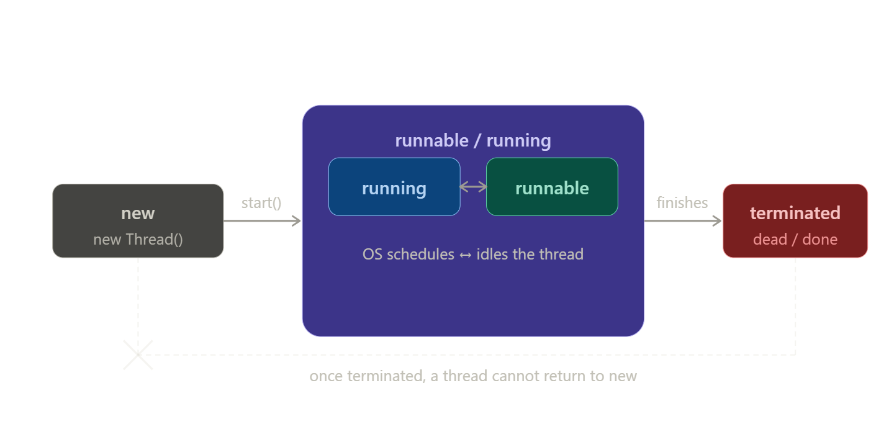

# Threads revision
## Basics
Runnable
- (Functional) Interface
- Lambda expression
-  run()
- 
Thread
- Class
- start()
- Process

Atomic processing within a Thread

## How to implement a Thread

```Java
Thread t = new Thread(); // + some Runnable

Thread t = new MyThread(); // as my extended class

Thread t = new Thread(new Runnable() {
   @Override
   public void run() {
       // code here
   }
});

```

### Examples
This is a quite simple expample of a thread and waiting of finishing
```Java
Thread t = new Thread(
   () -> {
       // do something as thread
   });

// start the thread
t.start();

// wait until the thread is finished
t.join();
```

This is the same example as above but with one main change - 
the thread sleeps for 200 milliseconds
```Java
Thread t = new Thread(
   () -> {
       // do something as thread
       // you may need a try-catch
      Thread.sleep(200); // the thread sleeps for 200ms
   });

// start the thread
t.start();

// wait until the thread is finished
t.join();
```

## Thread States
Let's try to order the current states by lifetime of a _Thread_

States:
- `new` -> `Thread t = new Thread();` when the Thread is created
- `running / runnable` -> this states will be reached after `start()` is called
  - `running` means that the Thread is working
  - `runnable` means that the OS idles the Thread
- `terminate` -> when the Thread is terminated (dead). There is no way to bring the Thread into state `new`



### States when `running/runnable`
1. `waiting`

This state will be reached after calling methods like `sleep()`, `join()`, `wait()`, ... in some cases you can notify the Thread to wake up. This method is named `notify()`
You sometimes have to handle some InterruptExceptions

2. `blocking`

This state locks the resources. This state will be the reached after using `synchronized` or some other word with `synch...`
